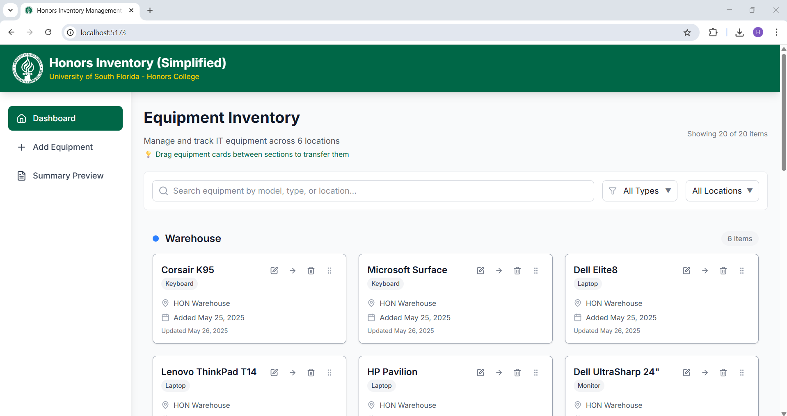
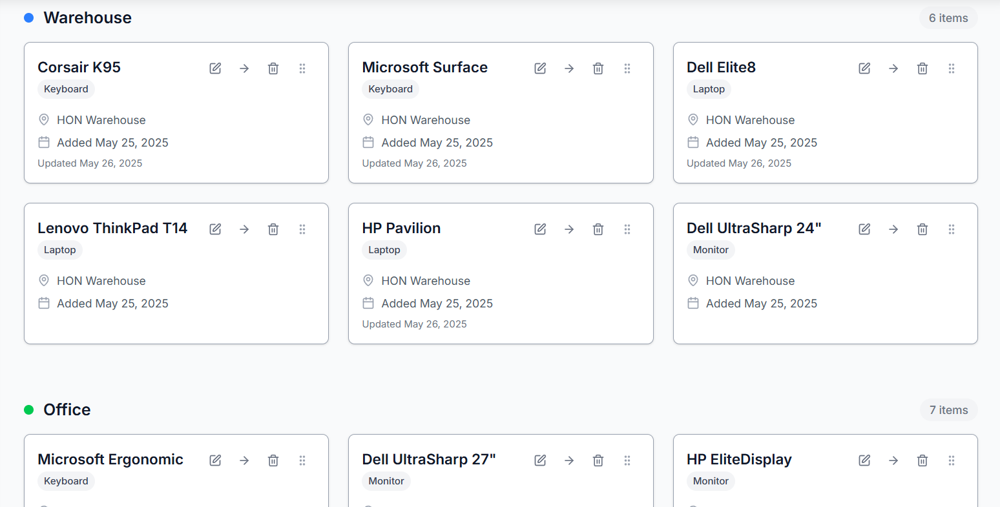
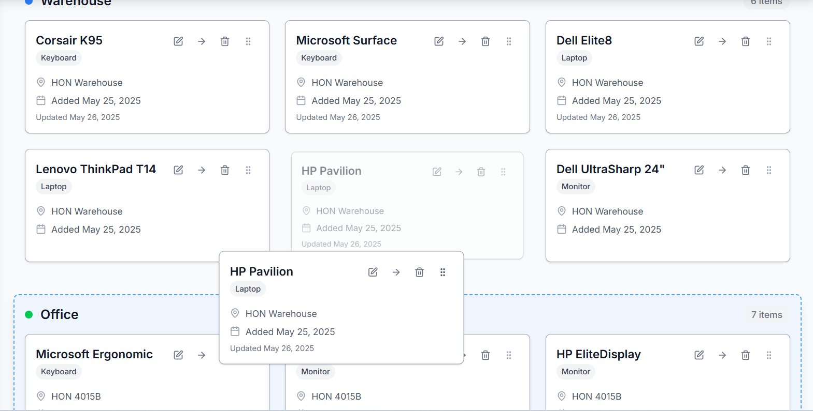
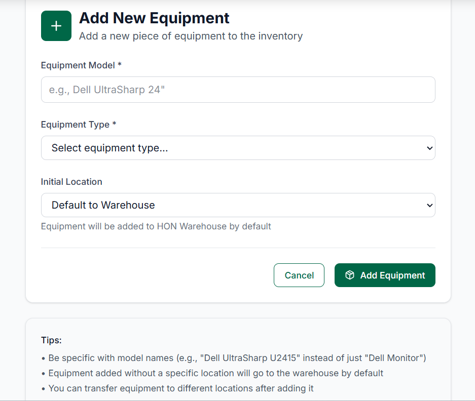
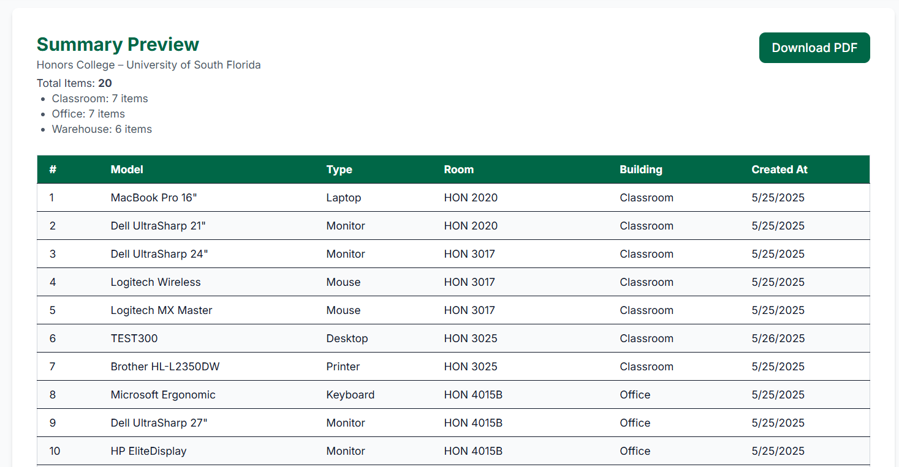
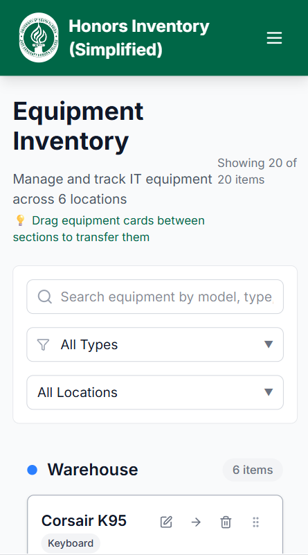

# Honors Inventory Management System - Simplified

A full-stack inventory management application built for the University of South Florida Honors College IT Team. This system allows tracking, managing, and transferring IT equipment across different locations within the building.

## Table of Contents

- [Demo](#demo)
- [Tech Stack](#tech-stack)
- [Design](#design)
- [Prerequisites](#prerequisites)
- [Getting Started](#getting-started)
  - [Step 1: Clone the Repository](#step-1-clone-the-repository)
  - [Step 2: Database Setup](#step-2-database-setup)
  - [Step 3: Backend Setup](#step-3-backend-setup)
  - [Step 4: Frontend Setup](#step-4-frontend-setup)
- [Verification Steps](#verification-steps)
- [Troubleshooting](#troubleshooting)
- [Project Structure Overview](#project-structure-overview)
- [API Endpoints](#api-endpoints)
- [Features](#features)
- [Available Scripts](#available-scripts)
- [Getting Help](#getting-help)

## Demo

### Live Application Demo


_Complete workflow: adding equipment, transferring between locations, and generating reports_

### Key Features

| Dashboard                               | Equipment Management                              | Drag and Drop                            |
| --------------------------------------- | ------------------------------------------------- | ---------------------------------------- |
|  |  |  |

| Add Equipment Form                | PDF Report Preview                            | Mobile View                                |
| --------------------------------- | --------------------------------------------- | ------------------------------------------ |
|  |  |  |

## Tech Stack


**Frontend:**

- React 19 with TypeScript
- Vite 6.3+ (build tool)
- Tailwind CSS 4.1+ (styling)
- Axios 1.9+ (HTTP client)
- React Router 7.6+ (routing)
- Formik 2.4+ (form management)
- Lucide React 0.511+ (icons)
- @dnd-kit/core 6.3+ (drag and drop functionality)
- Sonner 2.0+ (toast notifications)
- jsPDF 3.0+ with autotable (PDF generation)

**Backend:**

- ASP.NET Core 9.0
- Entity Framework Core 9.0 (preview)
- SQL Server (can be configured for other databases)
- RESTful API architecture
- Swagger/OpenAPI documentation

**Database:**

- SQL Server (default)
- Entity Framework Code-First migrations

## Design

The application follows the University of South Florida's official branding:

- **Primary Green**: `#006747` (USF Green)
- **Secondary Gold**: `#FFD100` (USF Gold)
- Clean, academic layout with modern UI components
- Responsive design for desktop and mobile use
- Drag-and-drop interface for intuitive equipment management
- Toast notifications for user feedback

## Prerequisites

Before running this project, make sure you have the following installed:

- **Node.js 18+** and **npm**

  - Download from [nodejs.org](https://nodejs.org/)
  - Verify installation: `node --version` and `npm --version`

- **.NET 9.0 SDK**

  - Download from [dotnet.microsoft.com](https://dotnet.microsoft.com/download/dotnet/9.0)
  - Verify installation: `dotnet --version`

- **SQL Server** (one of the following):

  - SQL Server Express (free)
  - SQL Server Developer Edition (free)
  - SQL Server LocalDB (included with Visual Studio)
  - Azure SQL Database

- **Git** for version control
  - Download from [git-scm.com](https://git-scm.com/)

## Getting Started

### Step 1: Clone the Repository

```bash
git clone https://github.com/Shepe1304/honors-inventory.git
cd honors-inventory
```

### Step 2: Database Setup

#### Using SQL Server Management Studio (SSMS)

1. Open SQL Server Management Studio
2. Connect to your SQL Server instance
   (e.g.,
   Server Type: Database Engine,
   Server Name: (localdb)\MSSQLLocalDB
   Authentication: Windows Authentication
   Encryption: Mandatory
   Click: Connect
   )
3. Open the file `database/schema.sql` or Create a new query then copy and paste the contents of `database/schema.sql`
4. Execute the script to create the database and sample data

### Step 3: Backend Setup

```bash
# Navigate to the backend project folder
cd backend/HonorsInventory.API

# Restore NuGet packages
dotnet restore

# Build the project to check for errors
dotnet build
```

#### Configure Connection String (if needed)

If you're not using LocalDB, update the connection string in `appsettings.json`:

```json
{
  "ConnectionStrings": {
    "DefaultConnection": "Your-Connection-String-Here"
  }
}
```

Common connection string examples:

- **LocalDB**: `Server=(localdb)\\mssqllocaldb;Database=HonorsInventoryDb;Trusted_Connection=true;`
- **SQL Server Express**: `Server=.\\SQLEXPRESS;Database=HonorsInventoryDb;Trusted_Connection=true;`
- **Remote SQL Server**: `Server=your-server;Database=HonorsInventoryDb;User Id=your-username;Password=your-password;`

#### Run the Backend

```bash
# Start the API (from backend/HonorsInventory.API folder)
dotnet run
```

You should see output similar to:

```
Building...
info: Microsoft.Hosting.Lifetime[14]
      Now listening on: https://localhost:5001
```

The API will be available at `https://localhost:5001` and Swagger documentation at `https://localhost:5001/swagger`

### Step 4: Frontend Setup

Open a **new terminal window** and navigate to the frontend folder:

```bash
# Navigate to frontend folder
cd frontend

# Install dependencies
npm install

# Start the development server
npm run dev
```

You should see output similar to:

```
  VITE v6.3.5  ready in 500 ms

  ➜  Local:   http://localhost:5173/
  ➜  Network: use --host to expose
  ➜  press h to show help
```

The frontend will be available at `http://localhost:5173`

## Verification Steps

### 1. Check Database Connection

- Navigate to `https://localhost:5001/swagger`
- Try the `GET /api/locations` endpoint
- You should see the sample locations data

### 2. Check Frontend-Backend Communication

- Open `http://localhost:5173` in your browser
- You should see the Honors Inventory (Simplified) dashboard
- Equipment should be loaded and displayed

### 3. Test Basic Functionality

- Try adding new equipment
- Try editing existing equipment
- Try transferring equipment between locations (drag-and-drop or forms)
- Try searching and filtering
- Try generating PDF reports
- Test toast notifications for user feedback

## Project Structure Overview

```
honors-inventory/
├── README.md                          # This file
├── .gitignore                         # Git ignore rules
├── honors.sln                         # Visual Studio solution file
├── screenshots/                       # Screenshots for README.md
├── database/
│   └── schema.sql                     # Database creation script
├── backend/
│   └── HonorsInventory.API/           # ASP.NET Core API
│       ├── HonorsInventory.API.csproj # Project file
│       ├── HonorsInventory.API.http   # HTTP test file
│       ├── Program.cs                 # Application entry point
│       ├── appsettings.json           # Configuration
│       ├── appsettings.Development.json # Dev configuration
│       ├── bin/Debug/net9.0/          # Build output
│       ├── obj/                       # Build intermediates
│       ├── Properties/
│       │   └── launchSettings.json    # Launch configuration
│       ├── Controllers/               # API endpoints
│       │   ├── EquipmentController.cs
│       │   └── LocationsController.cs
│       ├── Models/                    # Data models and DTOs
│       │   ├── Equipment.cs
│       │   ├── Location.cs
│       │   └── DTOs/
│       ├── Data/                      # Entity Framework context
│       │   ├── InventoryContext.cs
│       │   └── DbInitializer.cs
│       └── Services/                  # Business logic
│           ├── EquipmentService.cs
│           └── IEquipmentService.cs
└── frontend/
    ├── node_modules/                  # Node dependencies
    ├── package.json                   # Frontend dependencies
    ├── package-lock.json              # Dependency lock file
    ├── README.md                      # Frontend-specific README
    ├── tsconfig.json                  # TypeScript configuration
    ├── tsconfig.app.json              # App-specific TypeScript config
    ├── tsconfig.node.json             # Node-specific TypeScript config
    ├── eslint.config.js               # ESLint configuration
    ├── vite.config.ts                 # Vite build configuration
    ├── index.html                     # Main HTML template
    ├── .env                           # Environment variables
    ├── .gitignore                     # Git ignore rules
    ├── public/
    │   ├── honors-logo.png            # USF Honors logo
    │   ├── honors-logo.svg            # USF Honors logo (SVG)
    │   └── vite.svg                   # Vite default logo
    └── src/
        ├── main.tsx                   # Application entry point
        ├── App.tsx                    # Root component
        ├── index.css                  # Global styles
        ├── vite-env.d.ts              # Vite type definitions
        ├── assets/                    # Static assets
        │   ├── honors-logo.png
        │   ├── honorsLogoBase64.ts    # Base64 encoded logo
        │   └── react.svg
        ├── types/
        │   └── index.ts               # TypeScript type definitions
        ├── services/
        │   └── api.ts                 # API communication layer
        ├── hooks/
        │   └── useEquipment.ts        # Custom React hooks
        └── components/                # React components
            ├── Layout/
            │   ├── Header.tsx
            │   └── Sidebar.tsx
            ├── Common/
            │   ├── Button.tsx
            │   ├── LoadingSpinner.tsx
            │   └── Modal.tsx
            ├── Equipment/
            │   ├── AddEquipmentForm.tsx
            │   ├── EditEquipmentForm.tsx
            │   ├── EquipmentCard.tsx
            │   ├── EquipmentCard2.tsx
            │   ├── EquipmentList.tsx
            │   ├── EquipmentList2.tsx
            │   └── TransferEquipmentModal.tsx
            └── Reports/
                └── SummaryPreview.tsx
```

## API Endpoints

Once running, these endpoints will be available:

### Equipment

- `GET /api/equipment` - Get all equipment
- `GET /api/equipment/{id}` - Get equipment by ID
- `POST /api/equipment` - Create new equipment
- `PUT /api/equipment/{id}` - Update equipment
- `DELETE /api/equipment/{id}` - Delete equipment
- `PUT /api/equipment/{id}/transfer` - Transfer equipment to new location

### Locations

- `GET /api/locations` - Get all locations

## Features

- **Equipment Management**: Add, edit, delete, and view IT equipment
- **Location Tracking**: Track equipment across Warehouse, Office, and Classroom locations
- **Transfer System**: Move equipment between locations with audit trail and drag-and-drop interface
- **Search & Filter**: Find equipment by type, model, or location
- **PDF Export**: Generate equipment reports and documentation
- **Form Management**: Robust form handling with validation using Formik
- **Toast Notifications**: Real-time user feedback with Sonner
- **Modern Icons**: Comprehensive icon set with Lucide React
- **Responsive Design**: Works on desktop and mobile devices
- **Type Safety**: Full TypeScript implementation for better development experience
- **Modern React**: Built with React 19 and latest patterns

## Available Scripts

### Frontend

- `npm run dev` - Start development server
- `npm run build` - Build for production
- `npm run lint` - Run ESLint
- `npm run preview` - Preview production build

### Backend

- `dotnet run` - Start development server
- `dotnet build` - Build the project
- `dotnet restore` - Restore NuGet packages

## Getting Help

If you encounter issues:

1. **Check the console logs** in both terminal windows for error messages
2. **Verify all prerequisites** are installed and up to date
3. **Check database connectivity** using SQL Server Management Studio
4. **Clear browser cache** and restart both servers
5. **Check firewall settings** if you can't access the applications

---

Built with ❤️ for the USF Honors College IT Team
